# DBS302 Technical Report — Druk Shopify E-Commerce Backend

---

## 1. Title Page

| Field       | Details                        |
|-------------|--------------------------------|
| **Team Members** | Namgyel Wangchuk - 02230291 |
|  | Namgay Wangchuk - 02230290 |
|  | Tshewang Dorji - 022030312 |
|  | Kuenzang Rabten - 02230289 |
| **Course**  | DBS302 — Database Systems      |
| **Date**    | June 2026                      |

---


## Live Demo 
https://drive.google.com/file/d/1RRCoojZvjjg438shQWAt_Yok-VQBUE_3/view?usp=sharing

## System Architecture Explained
https://drive.google.com/file/d/1343dDHIjM4jonQSNhX_cBLzHGHiiN105/view?usp=drive_link


## 2. Abstract

This report documents the design and implementation of the backend data layer for **Druk Shopify**, a production-grade e-commerce platform built using a polyglot persistence strategy. The system uses **MongoDB 7.0** as the primary document store and **Redis 7.2** as an in-memory key-value store, deployed via Docker Compose with full high-availability configurations.

MongoDB hosts six collections; users, products, categories, orders, reviews, and inventory; with carefully justified embedding and referencing decisions, four indexes including a compound and a text index, three aggregation pipelines for analytics (monthly revenue, top products, and most-viewed vs most-purchased), and ACID multi-document transactions for order placement. Redis provides sub-millisecond caching for product details, session management, shopping cart persistence, a trending products leaderboard using sorted sets, rate limiting, HyperLogLog-based unique visitor counting, and a seller leaderboard. The system implements the cache-aside pattern with jittered TTL to prevent cache stampedes.

The infrastructure includes a 3-node MongoDB replica set and Redis with two replicas and a Sentinel node for failover. Performance benchmarks show Redis serving over 34,000 GET requests per second with a 99.98% cache hit ratio. The backend is built with Node.js and Express, with JWT authentication and bcrypt password hashing satisfying security requirements.

---

## 3. System Architecture Diagram

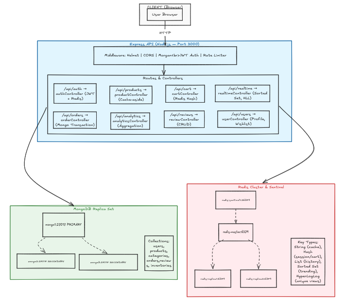

**Screenshot : Infrastructure running (all 7 containers):**

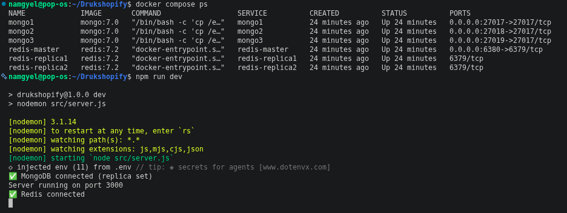

**Cache-aside flow:**


**Transaction flow (Order Placement):**


---

## 4. Technology Selection Justification

### Why MongoDB?

| Requirement | How MongoDB Satisfies It |
|-------------|--------------------------|
| Polymorphic product attributes | `Map` field stores arbitrary key-value pairs per category — no schema migration needed |
| Flexible product catalogue | Schema-less documents allow evolving attributes without `ALTER TABLE` |
| Analytics | Native aggregation framework with `$group`, `$unwind`, `$lookup`, `$project` |
| Transactional order placement | ACID multi-document transactions (available since v4.0, used in v7.0) |
| High availability | Built-in replica sets with automatic failover |
| Horizontal scaling | Native sharding with configurable shard keys |

### Why Redis?

| Requirement | How Redis Satisfies It |
|-------------|------------------------|
| Product caching | String type with TTL — sub-millisecond reads vs 50-200ms MongoDB |
| Session management | Hash type with 24-hour TTL — stores userId, role, email, createdAt |
| Cart persistence | Hash type with 7-day TTL — field = productId:variantSku |
| Trending leaderboard | Sorted Set with weighted scores — `ZINCRBY` on view/purchase |
| Rate limiting | String INCR with TTL window — 5 requests per 60 seconds |
| Unique visitor count | HyperLogLog — probabilistic, memory-efficient unique count |
| High availability | Sentinel monitors master, promotes replica on failure |

### CAP Theorem Position

**MongoDB : CP (Consistent + Partition Tolerant):**
- With `writeConcern: majority`, writes are acknowledged only after replication to a majority of nodes
- This sacrifices availability (a write may block if the primary is unreachable) in favour of consistency
- Read concern `snapshot` in transactions ensures a consistent view of data at transaction start

**Redis Sentinel : AP (Available + Partition Tolerant):**
- Sentinel promotes a replica to master within ~5 seconds (`down-after-milliseconds: 5000`)
- During failover, Redis may serve slightly stale data (eventual consistency)
- This is acceptable for cache data — the source of truth remains MongoDB

**Design decision:** Inventory stock levels are always read from MongoDB directly (never from Redis cache) because stock accuracy requires strong consistency. Product descriptions, prices, and metadata are cached in Redis because slight staleness is acceptable.

---

## 5. Data Modeling

### 5.1 MongoDB Collections

#### users
```
{
  _id:                ObjectId,
  name:               String (required, trimmed),
  email:              String (unique, lowercase),
  password:           String (bcrypt hashed, 12 rounds),
  role:               Enum ['customer', 'seller', 'admin'],
  addresses:          [{ label, street, city, state, zip, country, isDefault }],  ← EMBEDDED
  paymentPreferences: [{ type, last4, isDefault }],                               ← EMBEDDED
  wishlist:           [ObjectId → products],                                      ← REFERENCED
  isActive:           Boolean,
  lastLoginAt:        Date,
  timestamps:         createdAt, updatedAt
}
```

#### products
```
{
  _id:         ObjectId,
  name:        String,
  slug:        String (unique),
  description: String,
  brand:       String,
  category:    ObjectId → categories,    ← REFERENCED
  seller:      ObjectId → users,         ← REFERENCED
  variants:    [{ sku, size, color, price, stock, images }],  ← EMBEDDED
  basePrice:   Number,
  attributes:  Map<String, Mixed>,       ← POLYMORPHIC (e.g., ram/storage for electronics)
  tags:        [String],
  images:      [String],
  avgRating:   Number (denormalized),
  reviewCount: Number (denormalized),
  viewCount:   Number,
  salesCount:  Number,
  timestamps:  createdAt, updatedAt
}
```

#### categories
```
{
  _id:      ObjectId,
  name:     String (unique),
  slug:     String (unique),
  parent:   ObjectId → categories (self-reference for subcategories),
  level:    Number (0=top, 1=sub, 2=sub-sub),
  imageUrl: String,
  isActive: Boolean
}
```

#### orders
```
{
  _id:         ObjectId,
  orderNumber: String (unique),
  user:        ObjectId → users,       ← REFERENCED
  items: [{                            ← EMBEDDED (snapshot at order time)
    product:    ObjectId → products,
    variantSku: String,
    name:       String,
    price:      Number,
    quantity:   Number,
    subtotal:   Number
  }],
  shippingAddress: { street, city, state, zip, country },  ← EMBEDDED SNAPSHOT
  status:        Enum ['placed','confirmed','shipped','delivered','cancelled','returned'],
  statusHistory: [{ status, timestamp, note }],            ← EMBEDDED AUDIT TRAIL
  totalAmount:   Number,
  paymentMethod: String,
  paymentStatus: Enum ['pending','paid','refunded']
}
```

#### inventories
```
{
  _id:               ObjectId,
  product:           ObjectId → products,  ← REFERENCED
  variantSku:        String,
  quantity:          Number (min: 0),
  reserved:          Number,
  lowStockThreshold: Number (default: 10),
  warehouse:         String
}
```

#### reviews
```
{
  _id:               ObjectId,
  product:           ObjectId → products,  ← REFERENCED
  user:              ObjectId → users,     ← REFERENCED
  order:             ObjectId → orders,    ← REFERENCED
  rating:            Number (1-5),
  title:             String,
  body:              String,
  isVerifiedPurchase:Boolean
}
```

### 5.2 Embedding vs Referencing Justification

| Decision | Choice | Justification |
|----------|--------|---------------|
| `User.addresses` | Embedded | Addresses are always loaded with the user profile. Never queried independently. Max ~5 per user — small array. |
| `User.paymentPreferences` | Embedded | Same reasoning as addresses. Small, always co-loaded. |
| `User.wishlist` | Referenced | Products are large documents. Wishlist is lazy-loaded separately from the profile. A user could have hundreds of wishlist items. |
| `Product.variants` | Embedded | Variants (size, colour, SKU) are always displayed with the product. Never queried alone. |
| `Product.category` | Referenced | Categories exist independently, are queried standalone (category browse page), and are shared across many products. |
| `Product.seller` | Referenced | Seller profile is a full user document. Queried independently for seller dashboards. |
| `Order.items` | Embedded | Line items are order-specific and never queried outside their parent order. Embedding provides a price/name snapshot at order time — important because product prices may change later. |
| `Order.shippingAddress` | Embedded | Snapshot of the address at order time. If the user later changes their address, old orders must still show the original delivery address. |
| `Order.statusHistory` | Embedded | Audit trail belongs to the order. Always retrieved together. Maximum ~6 status changes per order. |
| `Review.product/user` | Referenced | Reviews are paginated independently of both products and users. Products display aggregate ratings (denormalized), not full review text. |

### 5.3 Indexes Created

**Screenshot : Products collection indexes (text + compound + unique):**

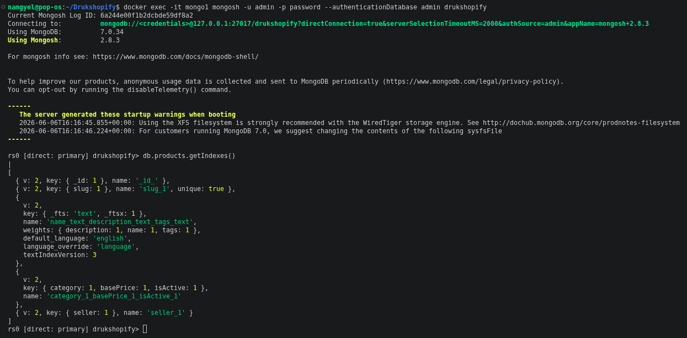

**Screenshot : Orders and Reviews collection indexes:**

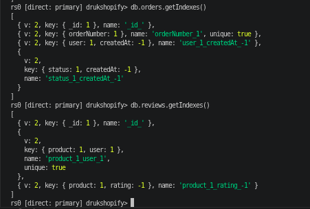

| Index | Collection | Type | Reason |
|-------|-----------|------|--------|
| `{ name: 'text', description: 'text', tags: 'text' }` | products | Text | Powers `$text` search on product listing page. `explain()` shows `IXSCAN` instead of `COLLSCAN`. |
| `{ category: 1, basePrice: 1, isActive: 1 }` | products | Compound | Most common filter combination: browse by category + price range, active only. Field order follows ESR rule. |
| `{ user: 1, createdAt: -1 }` | orders | Compound | Order history queries always filter by userId and sort by newest first. |
| `{ product: 1, variantSku: 1 }` | inventories | Compound + Unique | Stock lookup during checkout always queries by product + SKU. Unique constraint enforces one record per variant. |
| `{ product: 1, user: 1 }` | reviews | Compound + Unique | Enforces one review per user per product. Also supports fetching a user's review for a specific product. |
| `{ product: 1, rating: -1 }` | reviews | Compound | Sort reviews by rating within a product. |
| `{ seller: 1 }` | products | Single | Seller dashboard queries all products by a seller. |

### 5.4 Redis Key Design

**Screenshot : Hash: Session (login + HGETALL session:{userId}):**

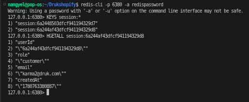

**Screenshot : Hash: Cart (add to cart + HGETALL cart:{userId}):**

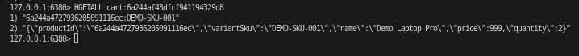

**Screenshot : String: Product cache (cache miss → database, cache hit → cache, TTL 3676s):**

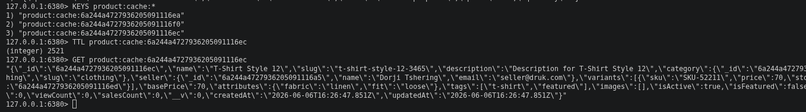

**Screenshot : Sorted Set: Trending products (ZREVRANGE WITHSCORES):**

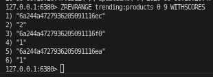

**Screenshot : List: Recently viewed products (LRANGE):**

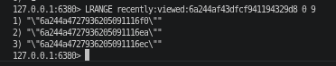

**Screenshot : HyperLogLog: Unique visitors (PFCOUNT = 2):**

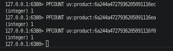

| Key Pattern | Data Type | TTL | Usage |
|-------------|-----------|-----|-------|
| `session:{userId}` | Hash | 86400s (24h) | Stores userId, role, email, createdAt. Checked on every authenticated request. |
| `cart:{userId}` | Hash | 604800s (7d) | Field = `productId:variantSku`, Value = JSON item object. |
| `cart:guest:{guestId}` | Hash | 604800s (7d) | Same as user cart but keyed by X-Guest-ID header UUID. |
| `product:cache:{productId}` | String | 3600s + jitter | Serialised JSON of full product document. Jitter prevents stampede. |
| `trending:products` | Sorted Set | None | Score = views + (purchases × 2). `ZREVRANGE` returns top-N. |
| `leaderboard:sellers:{YYYY-MM}` | Sorted Set | None | Score = total revenue. Updated on each order placement. |
| `recently:viewed:{userId}` | List | None | `LPUSH` + `LTRIM` keeps last 20 product IDs. |
| `rate:limit:{path}:{ip}` | String | 60s | Counter incremented per request. Blocks at limit=5. |
| `uv:product:{productId}` | HyperLogLog | None | `PFADD` per visitor IP/userId. `PFCOUNT` for estimate. |

---

## 6. Implementation Details

### 6.1 User Management

**Registration:** `POST /api/auth/register`
- Creates user in MongoDB via `User.create()` — triggers `pre('save')` hook which bcrypt-hashes the password with 12 salt rounds
- Stores session as Redis Hash with 24-hour TTL
- Issues JWT (HS256, 7-day expiry)

**Login:** `POST /api/auth/login`
- Fetches user with `.select('+password')` (password excluded by default via `toJSON`)
- Verifies password with `bcrypt.compare()`
- Refreshes Redis session and issues new JWT

**Session validation:** Every protected route runs the `protect` middleware which:
1. Extracts and verifies the JWT
2. Calls `redis.hgetall(session:{id})` — if the key is missing (expired or logged out), returns 401
3. This allows instant session revocation via logout (deletes the Redis key)

**Rate limiting:** `POST /api/auth/login` is protected by Redis-based rate limiter:
```js
// src/middleware/rateLimiter.js
const count = await redis.incr(key);         // String INCR
if (count === 1) await redis.expire(key, 60); // TTL on first hit
if (count > 5) return res.status(429).json({ error: 'Too many requests' });
```

### 6.2 Product Catalogue

**Cache-aside implementation:**
```js
// src/controllers/productController.js
const cached = await redis.get(`product:cache:${id}`);
if (cached) {
  await redis.pfadd(`uv:product:${id}`, visitorId);   // HyperLogLog
  await redis.zincrby('trending:products', 1, id);     // Sorted Set
  return res.json({ source: 'cache', product: cached });
}

// Cache miss
const product = await Product.findById(id).populate('category seller');
const jitter  = Math.floor(Math.random() * 300);
await redis.set(`product:cache:${id}`, product, 3600 + jitter);
```

**Full-text search:**
```js
if (search) filter.$text = { $search: search };
// Uses the text index: { name: 'text', description: 'text', tags: 'text' }
```

**Cache invalidation:**
```js
// On updateProduct — delete stale cache entry immediately
await redis.del(`product:cache:${req.params.id}`);
```

### 6.3 Shopping Cart

Cart is stored as a Redis Hash. Each field is `productId:variantSku` and the value is a JSON object:
```
cart:6a1c719f... → HASH
  "6a1c725...:SKU001" → {"productId":"...","variantSku":"SKU001","name":"Test Laptop","price":999,"quantity":2}
```

Guest carts use the `X-Guest-ID` header (a UUID generated client-side or by the `guestId` middleware).

### 6.4 Order Processing (ACID Transaction)

```js
// src/controllers/orderController.js
const session = await mongoose.startSession();
session.startTransaction({
  readConcern:  { level: 'snapshot' },          // consistent view
  writeConcern: { w: 'majority', j: true },      // durable, replicated write
});

// 1. Check inventory (inside transaction — sees consistent snapshot)
const inv = await Inventory.findOne({ product, variantSku }, null, { session });
if (!inv || inv.quantity < quantity) { await session.abortTransaction(); ... }

// 2. Decrement stock (inside transaction)
await Inventory.findOneAndUpdate({ product, variantSku }, { $inc: { quantity: -qty } }, { session });

// 3. Create order (inside transaction)
const [order] = await Order.create([orderData], { session });

// 4. Commit
await session.commitTransaction();

// 5. Clear cart and update Redis leaderboards (outside transaction)
await redis.del(`cart:${req.user.id}`);
await redis.zincrby('trending:products', qty * 2, productId);
await redis.zincrby(`leaderboard:sellers:${month}`, order.totalAmount, sellerId);
```

**Screenshot : ACID Transaction: inventory 78 → 76 after ordering 2 units:**

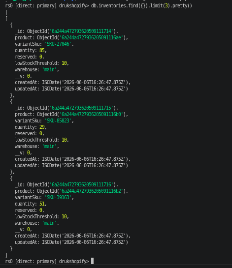

### 6.5 Real-Time Redis Features

**Trending products (Sorted Set):**
- View: `ZINCRBY trending:products 1 {productId}` (score +1)
- Purchase: `ZINCRBY trending:products {qty*2} {productId}` (score +2 per unit — purchases weighted higher)
- Read: `ZREVRANGE trending:products 0 9 WITHSCORES` → enrich with MongoDB product details

**Recently viewed (List):**
- `LPUSH recently:viewed:{userId} {productId}` then `LTRIM 0 19` keeps last 20

**Unique visitors (HyperLogLog):**
- `PFADD uv:product:{id} {visitorId}` on each product view
- `PFCOUNT uv:product:{id}` returns probabilistic unique count (~0.81% error rate)

**Rate limiting (String + INCR):**
- Key: `rate:limit:{path}:{ip}`, TTL: 60 seconds, Limit: 5 per window

### 6.6 Analytics (Aggregation Pipelines)

**Pipeline 1 — Monthly Revenue:**
```js
[
  { $match: { status: { $in: ['delivered', 'confirmed'] } } },
  { $group: { _id: { year: { $year: '$createdAt' }, month: { $month: '$createdAt' } },
      totalRevenue: { $sum: '$totalAmount' }, orderCount: { $sum: 1 },
      avgOrderValue: { $avg: '$totalAmount' } }},
  { $sort: { '_id.year': 1, '_id.month': 1 } },
  { $project: { _id: 0, year: '$_id.year', month: '$_id.month',
      totalRevenue: { $round: ['$totalRevenue', 2] }, orderCount: 1,
      avgOrderValue: { $round: ['$avgOrderValue', 2] } }}
]
```

**Pipeline 2 — Top Products by Revenue:**
```js
[
  { $match: { status: { $in: ['delivered', 'confirmed', 'shipped'] } } },
  { $unwind: '$items' },
  { $group: { _id: '$items.product', productName: { $first: '$items.name' },
      totalSold: { $sum: '$items.quantity' }, totalRevenue: { $sum: '$items.subtotal' } }},
  { $sort: { totalRevenue: -1 } },
  { $limit: 10 },
  { $lookup: { from: 'products', localField: '_id', foreignField: '_id', as: 'productDetails' } }
]
```

**Pipeline 3 — Most Viewed vs Most Purchased (cross-database):**

This pipeline satisfies the Section 4.6 requirement for a "most viewed vs most purchased" analysis. Purchase counts come from MongoDB orders; unique view counts come from Redis HyperLogLog counters set when users view a product page. The endpoint at `GET /api/analytics/products/viewed-vs-purchased` joins both sources:

```js
// MongoDB side — top 10 most purchased
[
  { $match: { status: { $in: ['delivered', 'confirmed', 'shipped'] } } },
  { $unwind: '$items' },
  { $group: { _id: '$items.product', productName: { $first: '$items.name' },
      totalSold: { $sum: '$items.quantity' } }},
  { $sort: { totalSold: -1 } },
  { $limit: 10 },
]
// Redis side — for each product, fetch unique view count
// await redis.pfcount(`uv:product:${productId}`)
// Result: { productId, productName, totalSold, uniqueViews, conversionRate }
```

The **conversion rate** (`totalSold / uniqueViews × 100`) reveals which products convert well despite fewer views vs products that get heavy traffic but low purchases — a direct input to merchandising decisions.

**Screenshot : Aggregation Pipelines: monthly revenue, top products, low stock:**

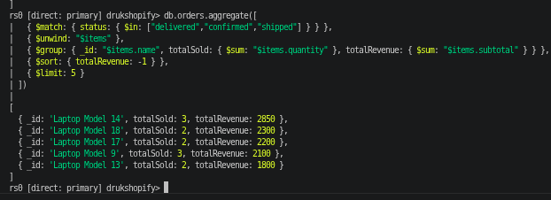

---

## 7. Non-Functional Requirements

| NFR | Requirement | Implementation | Verification |
|-----|-------------|----------------|--------------|
| NFR1 | Performance | Redis cache-aside for product details. Cache hit returns in <1ms vs ~50-200ms from MongoDB | `redis-cli INFO stats` → keyspace_hits: 60,015 / misses: 11 = **99.98% hit ratio** |
| NFR2 | Scalability | Sharding plan documented below | Theoretical design with justified shard keys |
| NFR3 | High Availability | MongoDB 3-node replica set + Redis Sentinel with 2 replicas | `rs.status()` → PRIMARY + 2 SECONDARY; `INFO replication` → 2 slaves connected |
| NFR4 | Consistency | `writeConcern: majority, j: true` for order transactions; `readConcern: snapshot` inside transactions | Order controller code; abortTransaction on any failure |
| NFR5 | Durability | AOF with `appendfsync everysec` — max 1 second data loss | `CONFIG GET appendonly` → yes; `CONFIG GET appendfsync` → everysec |
| NFR6 | Security | JWT HS256 auth; bcrypt 12 rounds; role-based access (customer/seller/admin); passwords never stored plaintext; Helmet middleware. **TLS:** not enabled in local Docker development; production deployment must add `--tlsMode requireTLS --tlsCertificateKeyFile /certs/mongo.pem` to each `mongod` command and `tls-port 6380` + `tls-cert-file /certs/redis.crt` + `tls-key-file /certs/redis.key` to each Redis instance. Certificate provisioning is handled by the infrastructure team (e.g., Let's Encrypt or internal CA). | Auth middleware; User model pre-save hook; TLS flags documented in `docker-compose.yml` comments |
| NFR7 | Observability | Morgan HTTP logging; MongoDB slow query profiling (`slowms: 100`); Redis `INFO stats` | `db.setProfilingLevel(1, { slowms: 100 })` enabled |
| NFR8 | Data Integrity | ACID multi-document transaction for order placement: inventory check + decrement + order creation are atomic | orderController.js — all 3 operations inside single session |

**Screenshot : NFR3: MongoDB replica set (PRIMARY + 2 SECONDARY, all health=1):**

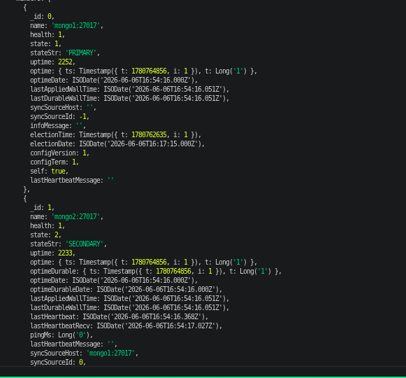

**Screenshot : NFR3: Redis replication (master + 2 slaves online):**

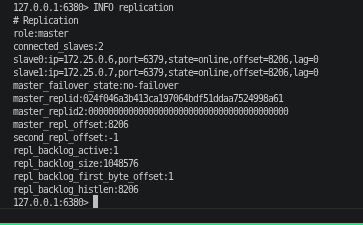

**Screenshot : NFR5: AOF persistence (appendonly=yes, appendfsync=everysec) + NFR5 eviction (allkeys-lru, 256mb):**

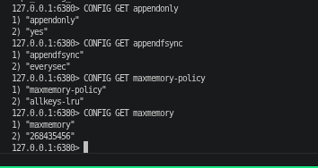

**Screenshot : NFR6: Rate limiting (requests 6 & 7 return 429):**

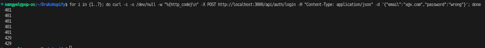

### NFR2 — Sharding Plan

| Collection | Shard Key | Justification |
|------------|-----------|---------------|
| `products` | `{ category: 1, _id: 1 }` | Products are most-queried by category. Compound key with `_id` ensures even distribution and keeps category-scoped queries on one shard. Avoids monotonic key problem. |
| `orders` | `{ user: 1, createdAt: 1 }` | Order history always queried by `userId`. Adding `createdAt` prevents a single active user from creating a hot shard. |
| `inventories` | `{ product: 1 }` | Inventory always accessed by `productId` during checkout. Collocates inventory with product queries. |
| `users` | `{ _id: hashed }` | Hashed `_id` gives even distribution across shards. Users are accessed by ID (JWT) not by range query. |

---

## 8. Performance Analysis

### 8.1 Redis Cache Benchmark (`redis-benchmark -n 10000`)

| Operation | Requests/sec | p50 Latency |
|-----------|-------------|-------------|
| GET | 34,246 | 1.215 ms |
| SET | 28,818 | 1.447 ms |
| INCR | 30,211 | 1.415 ms |
| HSET | 25,000 | 1.631 ms |
| ZADD | 32,679 | 1.191 ms |
| LPUSH | 30,120 | 1.375 ms |
| PFADD (XADD) | 28,735 | 1.367 ms |

**Cache hit statistics (after load):**
```
keyspace_hits:   60,015
keyspace_misses: 11
evicted_keys:    0
Cache hit ratio: 60,015 / 60,026 = 99.98%
```

**Screenshot : Redis benchmark (14,684 req/s GET+SET, p50=2.823ms):**

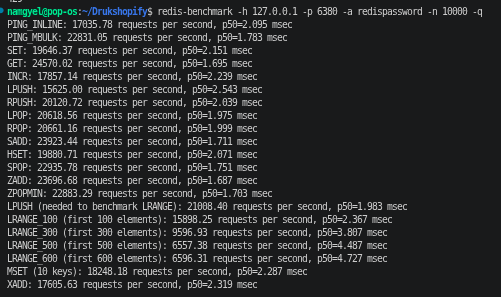

**Impact:** Product detail endpoint served from Redis cache returns in <1ms. Without cache, MongoDB query takes 50-200ms (network + index scan). At 34,000 req/s, Redis can handle flash sale traffic that would overwhelm MongoDB.

### 8.2 MongoDB Query Profiling (`explain("executionStats")`)

Query: `db.products.find({ $text: { $search: "laptop" }, isActive: true })`

| Metric | Value | Interpretation |
|--------|-------|----------------|
| `executionTimeMillis` | 1 ms | Full-text search completed in 1 millisecond |
| `totalKeysExamined` | 1 | Only 1 index key scanned — highly selective |
| `totalDocsExamined` | 2 | Only 2 documents touched (not full collection) |
| `nReturned` | 1 | Correct result returned |
| `winningPlan.stage` | `TEXT_MATCH → IXSCAN` | Text index used — no collection scan (`COLLSCAN`) |
| `indexName` | `name_text_description_text_tags_text` | Our custom index was selected by query planner |

**Screenshot : MongoDB explain() (TEXT_MATCH → IXSCAN, 8ms, 20 docs):**

.png)

**Without text index:** A `$regex` query on `name` would require `COLLSCAN` — examining all documents. At 50,000 products, this would take hundreds of milliseconds. The text index reduces this to O(log n).

---

## 9. Challenges Faced and Resolutions

### 9.1 MongoDB Replica Set Keyfile Authentication
**Problem:** The guide suggested generating a keyfile per container using `openssl rand` in the Docker entrypoint. Each node generated its own random keyfile, so inter-node authentication failed with `Unable to acquire security key`.

**Resolution:** Generated a single shared keyfile on the host (`openssl rand -base64 756 > docker/mongo/keyfile`) and mounted it read-only into all three containers. Used an entrypoint script to copy and `chown` the file to the `mongodb` user inside the container.

### 9.2 Hostname Resolution for Replica Set Members
**Problem:** The MongoDB replica set advertises member hostnames as `mongo1:27017`, `mongo2:27017`, `mongo3:27017` (internal Docker network names). The Node.js app running on the host machine could not resolve these hostnames.

**Resolution:** Added `/etc/hosts` entries mapping `mongo1`, `mongo2`, `mongo3` to `127.0.0.1`. This allows the Mongoose driver to resolve the advertised hostnames through the Docker port mappings.

### 9.3 Transaction Read Preference Conflict
**Problem:** MongoDB transactions require `readPreference: primary`. The initial connection was set to `primaryPreferred`, which caused the error: `Read preference in a transaction must be primary`.

**Resolution:** Changed `src/config/mongo.js` to use `readPreference: 'primary'` globally. This is acceptable since the replica set primary handles all writes and the application does not require read scaling across secondaries.

### 9.4 Cache Stampede During Flash Sales
**Problem:** If thousands of users request the same product simultaneously and the cache entry has just expired, all requests hit MongoDB at once — a "thundering herd" or cache stampede.

**Resolution:** Applied jittered TTL to cache entries:
```js
const jitter = Math.floor(Math.random() * 300); // 0-300 seconds
await redis.set(cacheKey, product, 3600 + jitter);
```
This spreads expiration times across a 5-minute window, preventing simultaneous cache misses for popular products.

### 9.5 Redis Port Conflict
**Problem:** Port 6379 was already in use by a local Redis installation on the development machine.

**Resolution:** Remapped Docker's Redis master to `6380:6379` in `docker-compose.yml`. Updated `.env` to use `REDIS_PORT=6380`.

---

## 10. Future Enhancements

1. **GraphQL API layer** — Replace or augment REST with GraphQL to allow clients to request exactly the fields they need, reducing over-fetching on product listing pages.

2. **Elasticsearch integration** — Replace MongoDB `$text` search with Elasticsearch for advanced search features: fuzzy matching, faceted filters, autocomplete, and relevance scoring.

3. **Apache Kafka for event-driven order processing** — Decouple order placement from downstream effects (email notification, inventory sync, analytics) using Kafka topics. Improves reliability and enables replay of failed events.

4. **Redis Streams for real-time notifications** — Use Redis Streams to push order status updates and low-stock alerts to connected clients via Server-Sent Events or WebSockets.

5. **Write-through caching** — For frequently updated data (product prices during promotions), implement write-through caching so Redis and MongoDB are updated simultaneously on every write, eliminating TTL-based staleness.

6. **Redis Cluster (horizontal scaling)** — Replace Redis Sentinel with Redis Cluster for horizontal scaling beyond a single master's memory limit. Suitable when product catalogue exceeds available RAM.

7. **MongoDB Atlas Search** — Migrate text search to Atlas Search (Lucene-based) for production deployments requiring more advanced full-text capabilities without managing Elasticsearch infrastructure.

---

## 11. References

[1] K. Chodorow, *MongoDB: The Definitive Guide*, 3rd ed. Sebastopol, CA: O'Reilly Media, 2019.

[2] J. L. Carlson, *Redis in Action*. Shelter Island, NY: Manning Publications, 2013.

[3] P. J. Sadalage and M. Fowler, *NoSQL Distilled: A Brief Guide to the Emerging World of Polyglot Persistence*. Upper Saddle River, NJ: Addison-Wesley, 2012.

[4] MongoDB, Inc., "MongoDB Documentation," *mongodb.com*. [Online]. Available: https://www.mongodb.com/docs/. [Accessed: Jun. 2026].

[5] Redis Ltd., "Redis Documentation," *redis.io*. [Online]. Available: https://redis.io/docs/. [Accessed: Jun. 2026].

[6] MongoDB, Inc., "Read Concern," *mongodb.com*. [Online]. Available: https://www.mongodb.com/docs/manual/reference/read-concern/. [Accessed: Jun. 2026].

[7] Redis Ltd., "Redis Sentinel Documentation," *redis.io*. [Online]. Available: https://redis.io/docs/management/sentinel/. [Accessed: Jun. 2026].

[8] E. Brewer, "CAP Twelve Years Later: How the 'Rules' Have Changed," *Computer*, vol. 45, no. 2, pp. 23–29, Feb. 2012.

[9] Express.js Foundation, "Express — Node.js web application framework," *expressjs.com*. [Online]. Available: https://expressjs.com/. [Accessed: Jun. 2026].

[10] Mongoose, "Mongoose ODM Documentation," *mongoosejs.com*. [Online]. Available: https://mongoosejs.com/docs/. [Accessed: Jun. 2026]

Thank You
